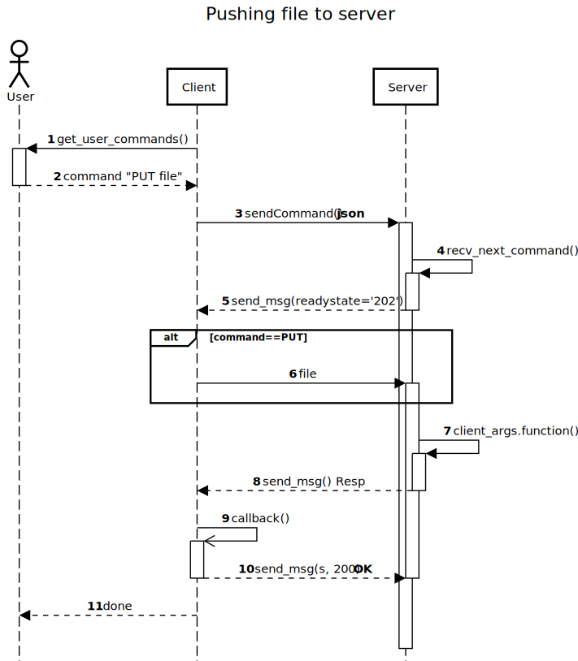

# COE451 Programming Assignment: FTP client-server

This repository is for a course project: "Introduction to Cyber Security COE451" at KFUPM.

[GitHub repository](https://github.com/FarisHijazi/Secure-FileTransfer)

Faris Hijazi [s201578750@kfupm.edu.sa](mailto:s201578750@kfupm.edu.sa)

Term 191

## Description

The application is programmed with python and has a command line interface, use `-h`, `--help` to see usage.  
There are 2 programs that must be run: the client and the server.

----

## How it works

The server continues to listen for connection requests, each time the user sends a command, the client will issue a connection request.

The bellow diagram demonstrates the use-case of pushing a file to the server (other use-cases are analogous).



## Usage

The client application can be invoked via the command line by passing arguments, if no arguments are passed, it will prompt for arguments to be input.

### Running the programs

Run the following commands while in the `scripts/` directory

- `python client/client.py`
- `python server/server.py`

An alternative is to run the exe files: `client.exe` and `server.exe` (order doesn't matter).
However it is better to use the python scripts as they are more likely up to date.

### Examples

1. Use `ls` to see what files are available

    

2. Request a specific file, for example by typing:

    ```sh
    get "doomguy (1).jpeg"
    ```

3. Once the file is downloaded from the server, the client app will open it in the explorer:  
    

### Terminal menu

```sh
usage: client.py [-h] [--port PORT] [--host HOST]
                 {help,quit,q,exit,get,put,ls} ...

Connect to server

positional arguments:
  {help,quit,q,exit,get,put,ls}
                        commands help...
    help                Display help message and usage
    quit (q, exit)      quit the program
    get                 pull a file from the server
    put                 push a file to the server (or loca
lly)
    ls                  list available files on th
optional arguments:
  --port PORT           port to listen on (non-privileged ports are >
                        1023).Default: 65432
  --host HOST           hostname or ipv4 address to connect to (use ip addr
ess
                        for consistency).Default: "127.0.0.1"
usage: client.py [-h] [--port PORT] [--host HOST]
                 {help,quit,q,exit,get,put,ls} ...

```

#### Subcommands

For each subcommand, you can view even more usage details by using `--help`

- get

    ```sh
    usage: client.py get [-h] [-i] filename

    positional arguments:
      filename

    optional arguments:
      -h, --help        show this help message and exit
      -i, --file-index  Enable file-access by index, rather than by specifying the
                        path. Use "ls" to see the corresponding index to each file
    ```

- put

    ```sh
    usage: client.py put [-h] [-i] filename

    positional arguments:
      filename

    optional arguments:
      -h, --help        show this help message and exit
      -i, --file-index  Enable file-access by index, rather than by specifying the
                        path. Use "ls -l" to list local files and see the
                        corresponding index to each file
    ```

Note: there are issues with the filenames when using `put --file-index`, so it's advised to just use the regular `put filename`

- ls

    ```sh
    usage: client.py ls [-h] [-l]

    optional arguments:
        -h, --help   show this help message and exit
        -l, --local  List files found locally (client side)
    ```

## Debugging

Sometimes the server may not respond to keyboard interrupts and the process must be killed.
To find out if any task is using a specific port (for example `65432`), run:

```
netstat -ano|findstr 65432
```

And to kill the task, get the PID and run:

```
taskkill /F /PID <PID>
```

----

## Credits and notes

The socket programming part of the code was taken from this [tutorial here](https://realpython.com/python-sockets/).

Since TCP is not a message protocol, rather it is a stream protocol, issues were encountered with receiving large messages and were solved by building a simple message protocol on top of TCP.
This can be achieved by pre-appending a 4-byte length field, this way the receiver knows how long it should keep accumulating the fragments (see solution from this answer on stackoverflow [here](https://stackoverflow.com/a/17668009/7771202)).
