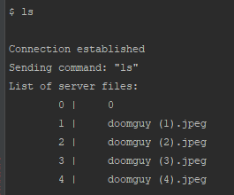
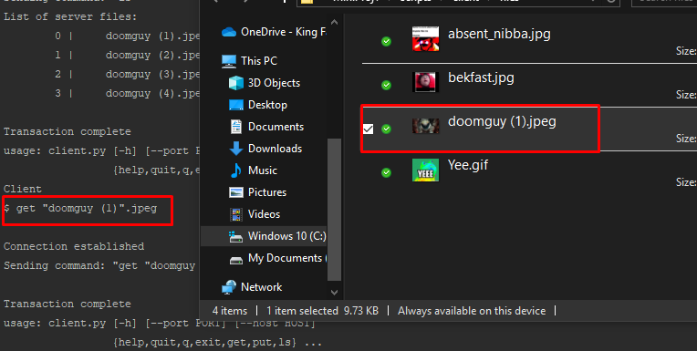

# COE451 Programming Assignment: FTP client-server

This repository is for a course project: "Introduction to Cyber Security COE451" at KFUPM.

[GitHub repository](https://github.com/FarisHijazi/Secure-FileTransfer)

Faris Hijazi [s201578750@kfupm.edu.sa](mailto:s201578750@kfupm.edu.sa)

Term 191

## Description

The application is programmed with python and has a command line interface, use `-h`, `--help` to see usage.  
There are 2 programs that must be run: the client and the server.

This program allows you to encrypt and send files between the client and the server using [Advanced Encryption Standard (AES)](https://en.wikipedia.org/wiki/Advanced_Encryption_Standard).

----

Table of contents:

- [COE451 Programming Assignment: FTP client-server](#coe451-programming-assignment-ftp-client-server)
  - [Description](#description)
  - [Requirements](#requirements)
  - [Sequence Overview](#sequence-overview)
  - [Usage](#usage)
    - [Running the programs](#running-the-programs)
    - [Examples](#examples)
    - [Terminal menu](#terminal-menu)
      - [Subcommands](#subcommands)
  - [Troubleshooting](#troubleshooting)
  - [Credits and notes](#credits-and-notes)

## Requirements

- python >= 3.0
- `pyaes`, you can install this using `pip install pyaes`

To make dependency installation easier, you can use the `requierments.txt` file.
To install the packages, `cd` to this project directory and execute:

```sh
pip install -r requirements.txt
```

## Sequence Overview

The server continues to listen for connection requests, each time the user sends a command, the client will issue a connection request.

The bellow diagram demonstrates the use-case of pushing a file to the server (other use-cases are analogous).


## Usage

The client and server scripts must both be running.
They can be invoked via command line.
Arguments can be passed in the command line as well, the user will be prompted for input if no arguments are found.

### Running the programs

An easy way to run the file and server is to use the batch files in the [tests](tests/) directory.  
Run:

- `tests/start_client.bat`
- `tests/start_server.bat`

Run the following commands while in the `scripts/` directory

- `python client/client.py`
- `python server/server.py`

### Examples

1. Use `ls` to see what files are available

    

2. Request a specific file, for example by typing:

    ```sh
    get "doomguy (1).jpeg"
    ```

3. Once the file is downloaded from the server, the client app will open it in the explorer:  
    
4. You can choose the cipher type as well as passing a key.  
   The following command will use AES encryption.

   ```sh
   client.py --cipher=aes --key='<INSERT_KEY_HERE>' put --file-index 0
   ```

### Terminal menu

```sh
COE451 ProgAssignment1: SFTP client-server.
Client side
Faris Hijazi s201578750 25-09-19.
=======================================

usage: client.py [-h] [--port PORT] [--host HOST] [-c {none,aes}] [-k KEY]
                 {help,quit,q,exit,get,put,ls} ...

Connect to server

positional arguments:
  {help,quit,q,exit,get,put,ls}
                        commands help...
    help                Display help message and usage
    quit (q, exit)      quit the program
    get                 pull a file from the server
    put                 push a file to the server (or locally)
    ls                  list available files on the server

optional arguments:
  -h, --help            show this help message and exit
  --port PORT           port to listen on (non-privileged ports are >
                        1023).Default: 65432
  --host HOST           hostname or ipv4 address to connect to (use ip address
                        for consistency).Default: "127.0.0.1"
  -c {none,aes}, --cipher {none,aes}
                        The encryption/decryption algorithm to use when
                        receiving the file.Applies to both "put" and "pull".
                        Default: none
  -k KEY, --key KEY     The key used for encryption/decryption.
```

#### Subcommands

For each subcommand, you can view even more usage details by using `--help`

- get

    ```sh
    usage: client.py get [-h] [-i] filename

    positional arguments:
      filename

    optional arguments:
      -h, --help        show this help message and exit
      -i, --file-index  Enable file-access by index, rather than by specifying the
                        path. Use "ls" to see the corresponding index to each file
    ```

- put

    ```sh
    usage: client.py put [-h] [-i] filename

    positional arguments:
      filename

    optional arguments:
      -h, --help        show this help message and exit
      -i, --file-index  Enable file-access by index, rather than by specifying the
                        path. Use "ls -l" to list local files and see the
                        corresponding index to each file
    ```

Note: there are issues with the filenames when using `put --file-index`, so it's advised to just use the regular `put filename`

- ls

    ```sh
    usage: client.py ls [-h] [-l]

    optional arguments:
        -h, --help   show this help message and exit
        -l, --local  List files found locally (client side)
    ```

## Troubleshooting

Sometimes the server may not respond to keyboard interrupts and the process must be killed.
To find out if any task is using a specific port (for example `65432`), run:

```
netstat -ano|findstr 65432
```

And to kill the task, get the PID and run:

```
taskkill /F /PID <PID>
```

----

## Credits and notes

The socket programming part of the code was taken from this [tutorial here](https://realpython.com/python-sockets/).

Since TCP is not a message protocol, rather it is a stream protocol, issues were encountered with receiving large messages and were solved by building a simple message protocol on top of TCP.
This can be achieved by pre-appending a 4-byte length field, this way the receiver knows how long it should keep accumulating the fragments (see solution from this answer on stackoverflow [here](https://stackoverflow.com/a/17668009/7771202)).
