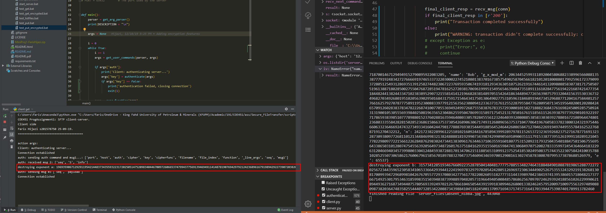
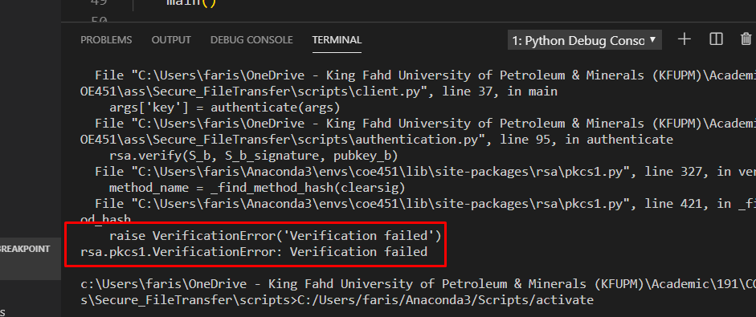
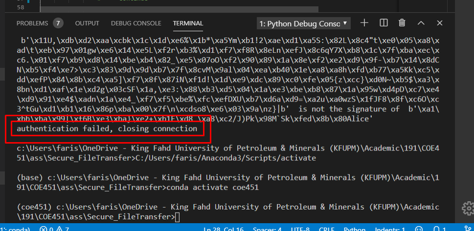

# Phase 3 report

## Requirements

Including authentication

## Implementation details

For the prime numbers, I'll be using the following:

At first I tried to hard-code the bellow values for the public and private keys, but it was problematic and I ended up generating a new key for every session.

### Client

p = 3136666666666666666666666666666666666666666666666666666666666666666666666666666666666666666666666666666666666666666666666666666666666666666666666666666666666666666666666666666666666666666666666666666666666666666666666666666666666666666666666666666666666666666666666666666666666666666666666666666666666666666666313

q = 3130000000000000000000000000000000000000000000000000000000000000000000000000000000000000000000000000000000000000000000000000000000000000000000000000000001183811000000000000000000000000000000000000000000000000000000000000000000000000000000000000000000000000000000000000000000000000000000000000000000000000000000313

which have been acquired from these links:

- https://primes.utm.edu/curios/page.php?number_id=10421
- https://primes.utm.edu/curios/page.php?number_id=162

### Server

p = 262641725682127839334668938847190331798311145333616792958372838424857156775007227102454928148183167823211534641943299795962309579874682913568608650959193370824474863282145037585560618568778906679404993323367715662527874977471424467472818616772123866421714232029284828476022113987781717658486369598393166193032285497153837454766280540159

q = 1357911131517193133353739515355575971737577799193959799111113115117119131133135137139151153155157159171173175177179191193195197199311313315317319331333335337339351353355357359371373375377379391393395397399511513515517519531533535537539551553555557559571573575577579591593595597599711713715717719731733735737739751753755757759771

which have been acquired from these links:

- https://primes.utm.edu/curios/page.php?number_id=3183
- https://primes.utm.edu/curios/page.php?number_id=10319

For the cryptographically secure random number generation,
I'm using python's [secrets](https://docs.python.org/3/library/secrets.html) library.

### Diffie Hellman

The vaules were hardcoded and chosen from the following website: https://www.ietf.org/rfc/rfc3526.txt

2048-bit MODP Group

   This group is assigned id 14.

   This prime is: 2^2048 - 2^1984 - 1 + 2^64 * { [2^1918 pi] + 124476 }

   Its hexadecimal value is:

      FFFFFFFF FFFFFFFF C90FDAA2 2168C234 C4C6628B 80DC1CD1
      29024E08 8A67CC74 020BBEA6 3B139B22 514A0879 8E3404DD
      EF9519B3 CD3A431B 302B0A6D F25F1437 4FE1356D 6D51C245
      E485B576 625E7EC6 F44C42E9 A637ED6B 0BFF5CB6 F406B7ED
      EE386BFB 5A899FA5 AE9F2411 7C4B1FE6 49286651 ECE45B3D
      C2007CB8 A163BF05 98DA4836 1C55D39A 69163FA8 FD24CF5F
      83655D23 DCA3AD96 1C62F356 208552BB 9ED52907 7096966D
      670C354E 4ABC9804 F1746C08 CA18217C 32905E46 2E36CE3B
      E39E772C 180E8603 9B2783A2 EC07A28F B5C55DF0 6F4C52C9
      DE2BCBF6 95581718 3995497C EA956AE5 15D22618 98FA0510
      15728E5A 8AACAA68 FFFFFFFF FFFFFFFF

   The generator is: 2.

## Assignment details

The code changes made for phase 3 can be found on GitHub, the branch [phase3-auth](https://github.com/FarisHijazi/Secure-FileTransfer/tree/phase3-auth).  
You can see the code changes made on [this page](https://github.com/FarisHijazi/Secure-FileTransfer/commits/phase3-auth).

The added code was mainly the [authentication.py](./scripts/authentication.py) file

## Tests and screenshots

to perform test1 and test2, you can pass the `--test=1` or `--test=2` arguments on the client's side.

### Showing exponent

### Bad key for bob (failed authentication)

### testcase3 TrudyPosingAsAlice

